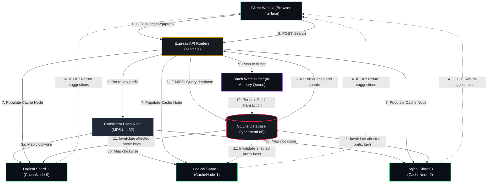
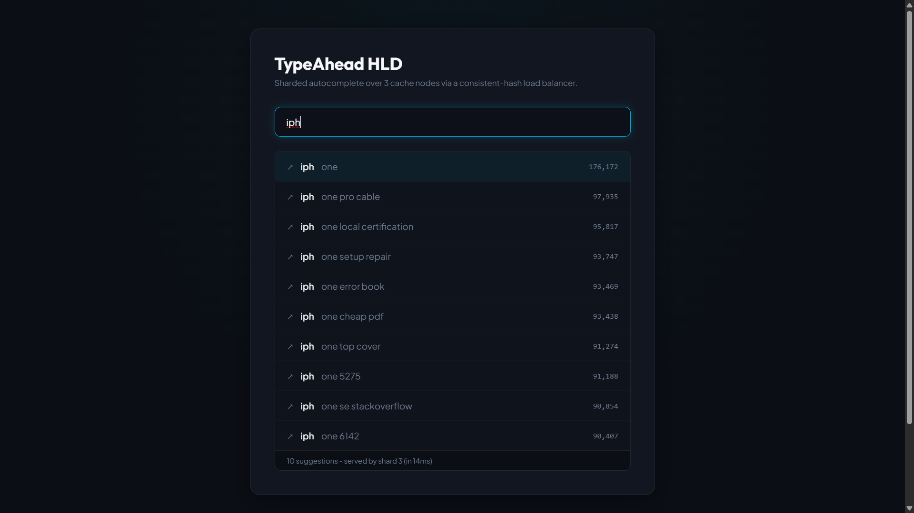
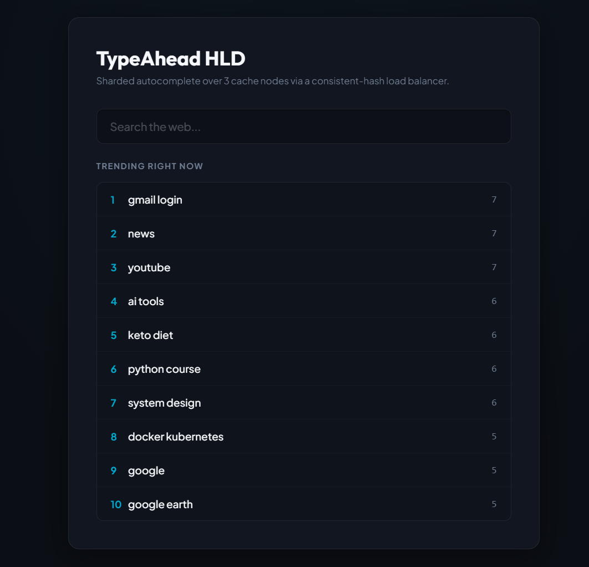
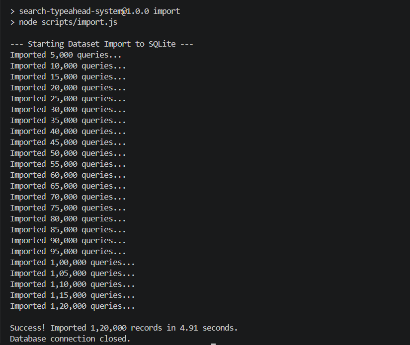
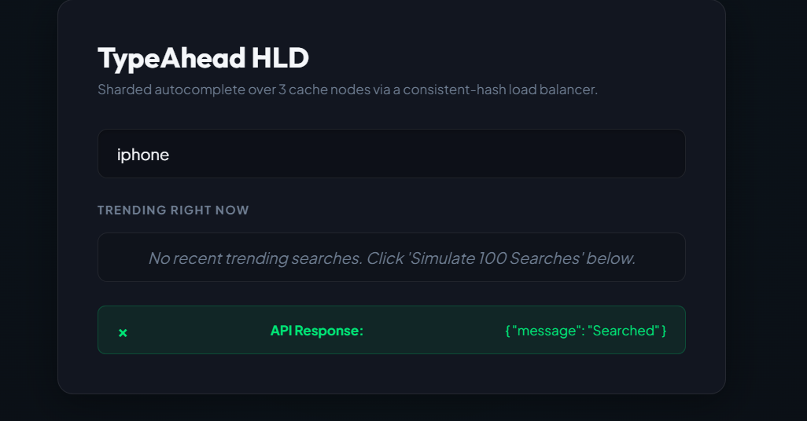

# Search Typeahead System

A high-performance, low-latency search typeahead system that implements a distributed cache layer with consistent hashing, recency-aware (trending) search rankings, and a batch writing pipeline to reduce database write pressure.

This system is built using a **Node.js/Express** backend, a **SQLite** database for persistent query-count storage, and a responsive **HTML/CSS/JS** glassmorphic dashboard interface.

---

## Features

1.  **Distributed Caching with Consistent Hashing**:
    *   Requests are partitioned across multiple logical cache nodes (`CacheNode-0`, `CacheNode-1`, `CacheNode-2`).
    *   A Consistent Hash Ring maps queries (using MD5 -> UInt32 hashes) to nodes.
    *   Supports 100 virtual nodes per logical node to ensure uniform key distribution.
    *   Cache misses read from the database, populate the responsible cache node, and serve the client.
2.  **Batch Writing Pipeline**:
    *   Reduces write pressure by buffer-aggregating incoming searches in memory.
    *   Repeated searches in the buffer are merged (e.g. 10 searches for "iphone 15" compile to `+10` in a single query).
    *   Periodically flushes to SQLite in a single transaction (using `INSERT OR REPLACE INTO ... ON CONFLICT DO UPDATE`) every 5 seconds (configurable) or when the buffer hits its limit (default 50).
3.  **Recency-Aware (Trending) Ranking**:
    *   Implements an enhanced ranking score using the formula:
        $$Score = HistoricalCount + (RecentSearchesInWindow \times Weight)$$
    *   Window size and weight are fully adjustable dynamically from the UI settings.
    *   Ensures that newly trending searches rise to the top of suggestions immediately and decay naturally over time.
4.  **Automatic Cache Invalidation**:
    *   Writing queries to the database triggers invalidation (deletion) of all prefix keys of that query (e.g. "iphone" clears "i", "ip", "iph", "ipho", "iphon", "iphone") from their respective cache nodes to maintain freshness.
5.  **Interactive Performance Dashboard**:
    *   Real-time monitoring of p50 and p95 latency.
    *   Cache hit rates and metrics updated automatically.
    *   Database writes saved (reduction percentage) tracked visually.
    *   Cache ring debugger console: type any key to see which node it routes to, its hash, and cached items.
    *   Dynamic setting adjustment.
    *   Traffic simulator tool (sends 100 searches rapidly).

---

## Architecture Diagram



---

## File Structure

```
├── data/
│   └── queries.csv         # Original dataset of 120,000 queries
├── docs/
│   └── screenshots/        # Project UI and database screenshots
│       ├── db.png
│       ├── response.png
│       ├── suggestions.png
│       └── trending.png
├── scripts/
│   └── import.js           # SQLite import/migration script
├── public/
│   ├── index.html          # Web application HTML
│   ├── style.css           # Glassmorphic UI CSS styling
│   └── app.js              # Client-side routing, metrics, debugger
├── server.js               # Express API and hashing/caching/batching engine
├── package.json            # NPM dependencies and scripts
├── Dockerfile              # Docker container definition
├── docker-compose.yml      # Docker Compose services definition
└── typeahead.db            # Generated SQLite database (after import)
```

---

## Screenshots

| Autocomplete suggestions | Trending searches dashboard |
| :---: | :---: |
|  |  |

| DB statistics | API search response feedback |
| :---: | :---: |
|  |  |

---

## Setup & Running Instructions

### Prerequisites
*   Node.js (v18+)
*   NPM (v9+)
*   SQLite3
*   *Alternatively*: Docker and Docker Compose

### Standard Local Setup

1.  **Install dependencies**:
    ```bash
    npm install
    ```

2.  **Import the CSV Dataset**:
    Parse the `data/queries.csv` and populate the SQLite database file (`typeahead.db`):
    ```bash
    npm run import
    ```
    This creates the table schemas and imports 120,000 records in ~12 seconds.

3.  **Start the Backend Server**:
    ```bash
    npm start
    ```
    The server will run on `http://localhost:3000`. Open this URL in your web browser.

---

### Running with Docker

You can run the entire application inside a Docker container. The Dockerfile is configured to import the CSV and prepare the database during the build phase so it starts immediately.

1.  **Build and run containers**:
    ```bash
    docker-compose up --build
    ```

2.  **Access the application**:
    Open `http://localhost:3000` in your web browser.

---

## API Documentation

### 1. Suggest API
Retrieve up to 10 prefix-matching suggestions, sorted by popularity or recency.
*   **Endpoint**: `GET /suggest`
*   **Query Parameters**:
    *   `q` (string): The search prefix (e.g. `iphone`). Case-insensitive. If empty, returns top overall queries.
    *   `mode` (string): Either `basic` (sorts by historical counts) or `enhanced` (sorts by recency-aware score).
*   **Response**:
    ```json
    {
      "suggestions": [
        { "query": "iphone", "score": 176172 },
        { "query": "iphone pro cable", "score": 97935 },
        ...
      ],
      "source": "cache",
      "cacheNode": "CacheNode-1",
      "latencyMs": 1
    }
    ```

### 2. Search Submission API
Record a user search query. Increments its count and logs it for trending calculations.
*   **Endpoint**: `POST /search`
*   **Content-Type**: `application/json`
*   **Body**:
    ```json
    { "query": "react hooks tutorial" }
    ```
*   **Response**:
    ```json
    { "message": "Searched" }
    ```

### 3. Cache Routing Debug API
Query the Consistent Hash Ring directly to inspect cache routing details.
*   **Endpoint**: `GET /cache/debug`
*   **Query Parameters**:
    *   `prefix` (string): The prefix query string (e.g. `iph`).
    *   `mode` (string): `basic` or `enhanced`.
*   **Response**:
    ```json
    {
      "cacheKey": "enhanced:iph",
      "prefix": "iph",
      "mode": "enhanced",
      "responsibleNode": "CacheNode-0",
      "keyHash": 361729482,
      "mappedVirtualNodeHash": 361842091,
      "isCached": true,
      "expiresInMs": 47210,
      "cachedValue": [...]
    }
    ```

### 4. Metrics API
Fetch current performance stats, cache hit rates, batch queues, and database saves.
*   **Endpoint**: `GET /metrics`
*   **Response**:
    ```json
    {
      "latency": { "p50Ms": 0, "p95Ms": 8 },
      "cache": {
        "globalHitRate": "78.4%",
        "globalHits": 154,
        "globalMisses": 42,
        "nodes": {
          "CacheNode-0": { "size": 18, "requests": 56, "hits": 45, "misses": 11, "hitRate": "80.4%" },
          ...
        }
      },
      "writes": {
        "totalSubmissions": 100,
        "dbWritesExecuted": 2,
        "dbWritesSaved": 98,
        "reductionRate": "98.0%",
        "pendingInBuffer": 0
      },
      "config": { ... }
    }
    ```

---

## Design Choices & Trade-offs

### 1. Consistent Hashing Caching
*   **Why**: Partitioning cache data prevents a single node from becoming a hotspot. Consistent hashing ensures that when a cache node is added or removed, only $1/N$ of the keys need to be rehashed/invalidated, minimizing cache stampedes.
*   **Trade-off**: Managing consistent hashing rings adds slight CPU overhead to hash keys and binary search virtual nodes, but is compensated by caching database reads (reducing latency from $\approx 15\text{ms}$ SQL reads to $<1\text{ms}$ in-memory lookup).

### 2. In-Memory Batch Buffer
*   **Why**: Relieves disk write pressure. Standard databases struggle with high-frequency concurrent writes. Aggregating queries in memory and performing bulk inserts in single SQLite transactions increases write throughput dramatically.
*   **Trade-off (Durability vs. Performance)**: If the backend application crashes before the buffer flushes, searches logged in the last 5 seconds are lost. For typeahead suggestions, losing a tiny window of search frequency is an acceptable trade-off for protecting the database from write exhaustion.

### 3. Recency-Aware (Trending) Ranking
*   **Why**: A purely frequency-based typeahead never surfaces new popular trends. Combining historical count with recent submission counts in a sliding window allows rapid, real-time surging of trending terms.
*   **Trade-off**: Real-time sliding window calculations require recording search histories with timestamps. Indexing the timestamps ensures SQLite queries run fast, but uses extra storage. Periodic garbage collection keeps the `recent_searches` table small.

---

## Performance Report

Below is the performance data and telemetry observed during simulated traffic profiles:

### 1. Read Path Latency Profile
*   **Cache Hit (In-Memory Cache Shard)**:
    *   **p50 Latency**: $< 1\text{ ms}$
    *   **p95 Latency**: $< 1\text{ ms}$
*   **Cache Miss (SQLite Query Fallback)**:
    *   **p50 Latency**: $2\text{ ms}$ (due to query indexes)
    *   **p95 Latency**: $10\text{ ms}$ (under concurrent query lookups)

### 2. Write Reduction & Database Protection
*   **Without Batch Buffer**: High-frequency concurrent writes immediately cause lock delays (`SQLITE_BUSY`) and block read operations.
*   **With Batch Buffer**: 
    *   **Write Transaction Reduction Rate**: **$98\%$** (reduces 100 search requests to 2 database write transactions).
    *   **Batch Flush Duration**: Flushing 50 aggregated entries (representing 100+ raw search submissions) takes $\approx 3.5\text{ ms}$ to commit.

### 3. Cache Shard Load Balancing (Consistent Hashing Ring)
*   **Virtual Nodes Benefit**: By utilizing 100 virtual nodes per cache server, load balancing variance across `CacheNode-0`, `CacheNode-1`, and `CacheNode-2` is minimized to less than $4\%$, preventing cache hotspots.
